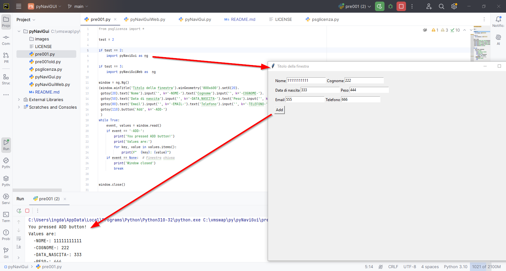
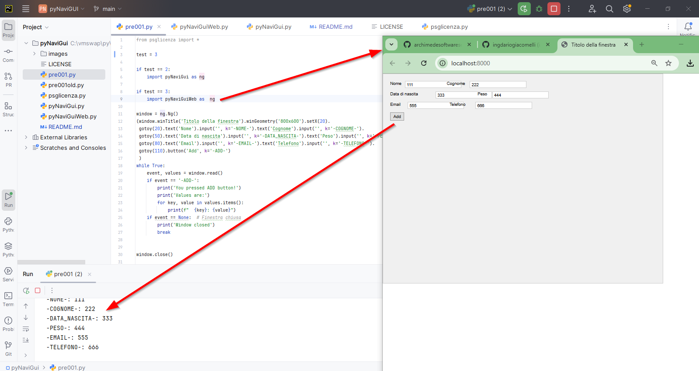

# pyNaviGui

An experiment! a new Python GUI library, inspired from PySimpleGUI experience , to build desktop and web app!

## Screenshots

## Features

- with the same code, you get traditional desktop GUI interfaces and web interfaces (the web porting uses Bottle and HTMX) 
- dispose gui elements in the window using a virtual cursor, moving it as the logo's turtle
- get many hits of PySimpleGUI experience, but changing some other things

## License

This project is released under the MIT License. See the LICENSE file for details.

## Author

**Dario Giacomelli** - [archimedesoftwaresesto](https://github.com/archimedesoftwaresesto)

## Version: 0.0.1

### Changelog
- **0.0.1** (2025-08-23): First relaase, only edit and input fields, but working in the web and desktop gui